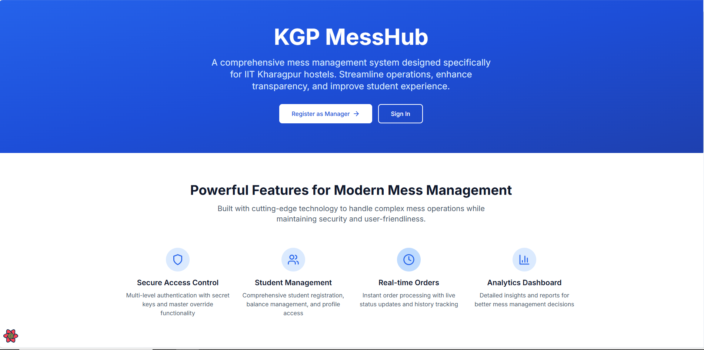
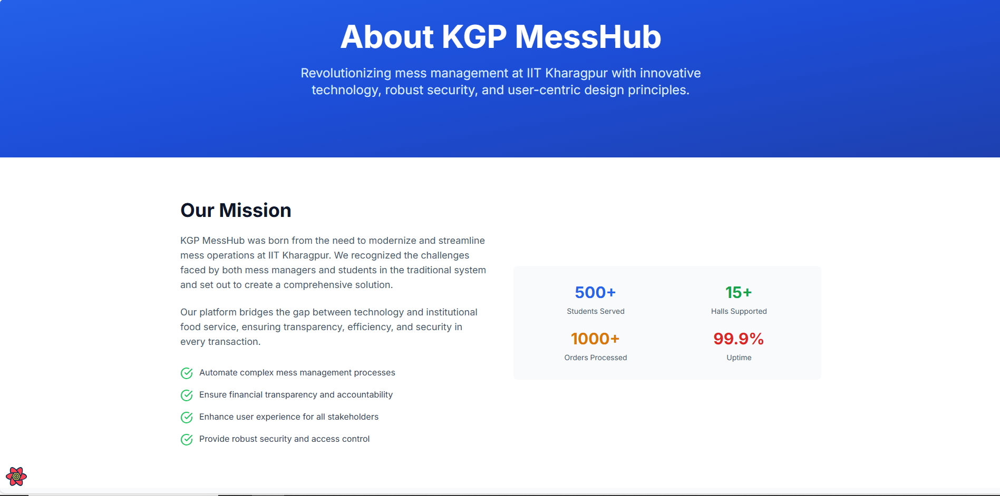
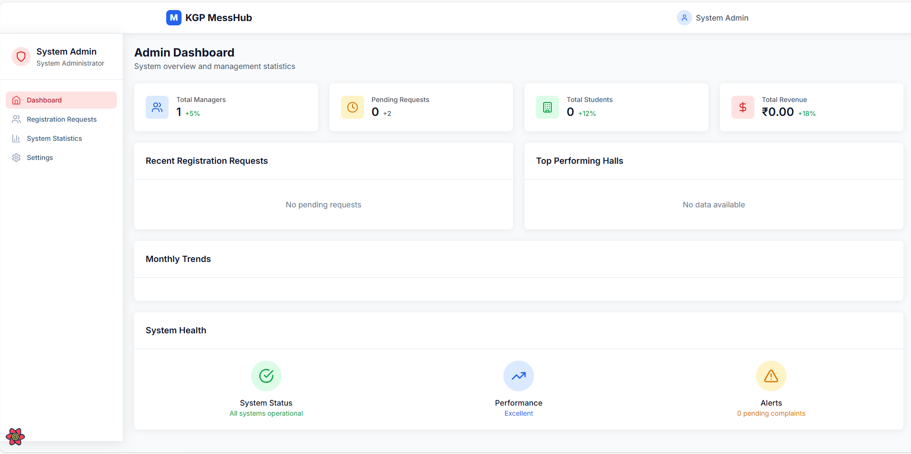
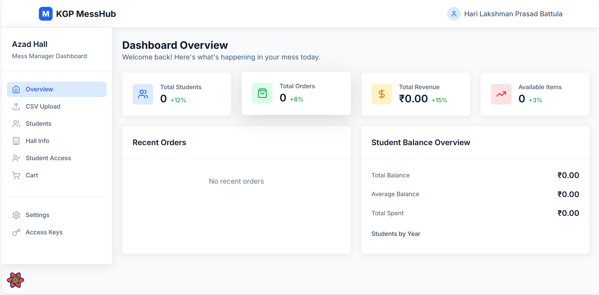

# 🍽️ KGP MessHub

A full-featured mess management web application built for the hostel messes at IIT Kharagpur. Designed to streamline student transactions, inventory, and order tracking with a secure multi-role access system.

---

## 📄 Overview

KGP MessHub is a web application concept born from my experience as a student at IIT Kharagpur, where I noticed the inefficiencies in hostel mess operations. My primary motivation was to digitize the manual mess book system, which required managers to painstakingly count records for every student. I wanted to help mess managers by eliminating the hassle of maintaining manual records, reducing errors, and streamlining daily accounting. This led to a broader vision: creating a simple, transparent, and efficient system to track student transactions, monthly dues, and consumption trends—all in one place. From there, I began exploring additional ways to enhance the system, such as automating event coordination and improving menu transparency.

As someone new to web development, I explored this project with the help of AI tools like Claude, which enabled me to prototype and learn while addressing real-world challenges. This README outlines the implemented features, proposed enhancements, and opportunities for collaboration to further develop this idea.

---

## 🚀 Implemented Features

- 🔐 **Multi-Role Authentication**: Admin approval for Mess Managers before login.
- 🧾 **Student Management**: Upload CSVs, manage profiles, and track balances.
- 🛒 **Order System**: Real-time cart, batch checkout, and order history tracking.
- 🗝️ **Secure Access Control**: Secret keys, manager overrides, and role-based visibility.
- 📊 **Analytics Dashboard**: Usage reports, statistics, and financial summaries.
- 🛠️ **Complaint System**: Students can raise requests; managers can review and act.

---

## 🌟 Proposed Features

I envision KGP MessHub evolving further to address additional challenges. Here are some ideas I’m exploring:

### 🧑‍🎓 Student Dashboard
- View today’s and upcoming mess menus.
- See real-time dish changes announced by managers.
- Access a personalized dashboard for meal registrations and event updates.

### 📅 Grand Dinner Automation
- Managers can initiate a Grand Dinner or Snacks event.
- Generate unique QR codes for each student in the hall for event entry.
- Students display their QR code, which managers scan to validate hall membership and track participation.
- Display participation counts in the manager dashboard to monitor attendance.

### 📈 Future Enhancements
- **Real-Time Menu Updates**: Enable managers to post last-minute dish changes, instantly visible to students.
- **Student Feedback System**: Allow students to rate meals daily, with analytics to help managers improve food quality.
- **Cross-Hall Security**: Ensure students can only participate in their hall-specific events through secure validation.
- **Digital Coupon Distribution**: Automate coupon generation for limited-distribution events, reducing manual effort and ensuring fairness.

---

## 🛠️ Tech Stack

### 📦 Backend
- Node.js + Express.js
- MongoDB with Mongoose
- JWT for Auth
- Multer for file uploads
- Nodemailer for email workflows

### 🎨 Frontend
- React.js + Vite
- Tailwind CSS
- React Query for API state
- React Hook Form for validation
- React Router for routing

### 🔌 Additional Tech (Proposed)
- **QR Code Generation & Scanning**: To be explored (e.g., using libraries like `qrcode` for generation and a scanning solution for validation)

---

## 📁 Project Structure

```
kgp-messhub/
├── client/                 # React frontend
│   ├── public/            # Static assets
│   └── src/
│       ├── components/    # UI Components
│       ├── context/       # Context providers
│       ├── hooks/         # Custom React hooks
│       ├── pages/         # Page-level components
│       ├── services/      # API integrations
│       ├── styles/        # Tailwind & global CSS
│       └── utils/         # Utility functions
├── server/                 # Node backend
│   ├── config/            # DB and app config
│   ├── controllers/       # Route controllers
│   ├── middleware/        # Express middleware
│   ├── models/            # MongoDB models
│   ├── routes/            # Express routes
│   ├── utils/             # Utility functions
│   └── uploads/           # Uploaded files
|
└── README.md               # Project README
```

---

## 📄 Motivation

This project stems from my personal experience navigating the hostel mess system at IIT Kharagpur. I noticed inefficiencies in manual processes—like students manually ticking names off lists for Grand Dinners, which often led to errors or misuse, such as students from other halls attending events they weren’t eligible for. Additionally, last-minute menu changes weren’t communicated effectively, leaving students uninformed.

My goal is to create a system that reduces manual intervention, ensures transparency in menu updates, and automates event coordination with secure access controls. By digitizing these processes, I hope to improve efficiency and fairness while enhancing the student experience.

---

## 🛠️ Getting Started

### 🔧 Prerequisites
- Node.js v16+
- MongoDB v5+
- npm or yarn

### 📦 Installation Steps

1. **Clone the repository**
   ```bash
   git clone <repository-url>
   cd kgp-messhub
   ```

2. **Install server dependencies**
   ```bash
   cd server
   npm install
   ```

3. **Install client dependencies**
   ```bash
   cd ../client
   npm install
   ```

4. **Set up environment variables**
   ```bash
   cd ../server
   cp .env.example .env
   # Edit the .env file with your configuration
   ```

5. **Run development servers**

   **Backend**:
   ```bash
   cd server
   npm run dev
   ```

   **Frontend**:
   ```bash
   cd ../client
   npm run dev
   ```

---

## 🔌 API Documentation

### 🔐 Authentication
- `POST /api/auth/register` — Register Mess Manager  
- `POST /api/auth/login` — Login  
- `GET /api/auth/me` — Get current user info  
- `PUT /api/auth/profile` — Update profile  
- `PUT /api/auth/change-password` — Change password  

### 👥 Student Management
- `POST /api/students/upload-csv` — Upload student data  
- `GET /api/students` — Fetch all students  
- `POST /api/students/search` — Search by roll/name/year  
- `POST /api/students/:id/access` — Access student profile securely  

### 🧾 Order System
- `POST /api/orders` — Create new order  
- `GET /api/orders` — List all orders  
- `GET /api/orders/stats` — Order statistics  
- `PUT /api/orders/:id/status` — Update order/payment status  

---

## 📸 Screenshots

Here are some snapshots of the current application:

- 
- 
- 
- 

(To be added: Student Dashboard)

---

## 📈 Ideas for Enhancement

I believe this system can evolve further with community input. I welcome suggestions from contributors who find this concept interesting to help make KGP MessHub more robust and useful. My proposed enhancements (listed above) are a starting point, and I envision this hub growing into a broader hostel management ecosystem, potentially integrating inventory management, financial tracking, and more.

---

## 🤝 Contributing

1. Fork the repository  
2. Create a new feature branch  
3. Make your changes  
4. Add tests (if applicable)  
5. Submit a pull request  

---

## 📄 License

Licensed under the **MIT License**.

---

## 📬 Support

For support or feedback, contact:  
📧 `support@kgpmesshub.com`  
📁 Or open an issue in the GitHub repository

---

## 🙏 Call for Collaboration

This project is a work in progress, and I’m eager to collaborate with others to bring these ideas to life. As I continue to learn web development, I invite contributors to fork this repository, share ideas, or open issues to help enhance KGP MessHub. Together, we can build a system that truly serves the IIT Kharagpur student community.

---

> Conceptualized with ❤️ for the IIT Kharagpur student community.